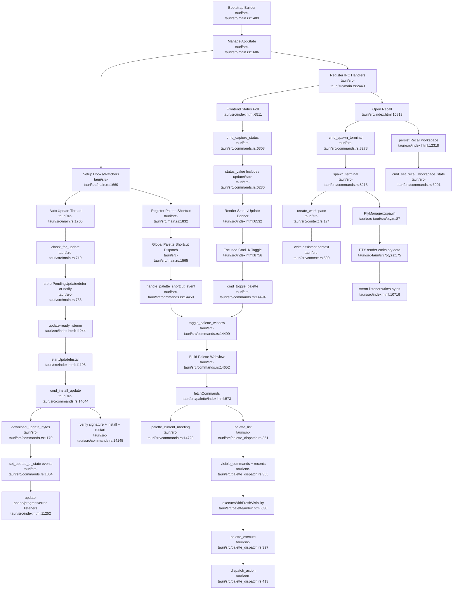

# Desktop Shell, Command RPC, Recall, Palette, And Updates

## Flowchart

## Notes

- The desktop app has one `AppState` and one IPC registration surface, but `commands.rs` is a very large mixed command/RPC module.
- Palette, Recall, updates, recording state, dictation, live transcript, and settings all converge through the same status polling and event bus.
- The shell’s duplication risk is less about algorithms and more about repeated lifecycle/status gating across commands.

## Sources

- `tauri/src-tauri/src/main.rs:1409-1736`, `tauri/src-tauri/src/main.rs:1828-1860`, `tauri/src-tauri/src/main.rs:2449-2570`
- `tauri/src-tauri/src/commands.rs:6230-6336`, `tauri/src-tauri/src/commands.rs:6890-6942`, `tauri/src-tauri/src/commands.rs:8213-8330`, `tauri/src-tauri/src/commands.rs:14044-14205`, `tauri/src-tauri/src/commands.rs:14459-14735`
- `tauri/src-tauri/src/palette_dispatch.rs:351-758`
- `tauri/src-tauri/src/pty.rs:85-224`
- `tauri/src-tauri/src/context.rs:174-539`
- `tauri/src/index.html:6490-6555`, `tauri/src/index.html:8728-8780`, `tauri/src/index.html:10640-11295`, `tauri/src/index.html:12310-12342`
- `tauri/src/palette/index.html:573-666`
