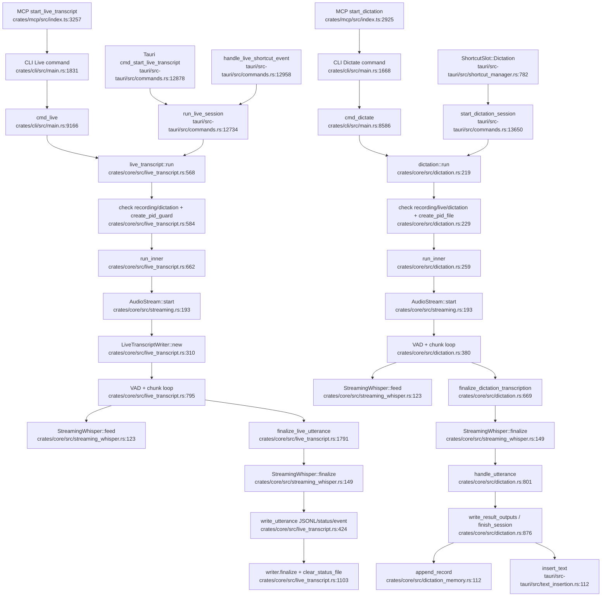

# Live Transcript And Dictation

## Flowchart

## Notes

- Live and dictation share streaming/VAD/Whisper mechanics but intentionally diverge at output: live writes JSONL/status/events, dictation writes clipboard/files/daily note/history and Tauri insertion.
- Session guard concepts are duplicated across CLI, Tauri atomics, MCP checks, and core PID checks.
- MCP `stop_dictation` sends SIGTERM to `dictation.pid`, while CLI dictation ignores SIGTERM on Unix; this is a probable correctness gap.

## Sources

- `crates/core/src/live_transcript.rs:568-1135`, `crates/core/src/live_transcript.rs:1791-2078`
- `crates/core/src/dictation.rs:219-720`, `crates/core/src/dictation.rs:801-940`, `crates/core/src/dictation.rs:946-1187`
- `crates/core/src/streaming.rs:177-260`
- `crates/core/src/streaming_whisper.rs:83-230`
- `crates/cli/src/main.rs:1668-1695`, `crates/cli/src/main.rs:8586-8713`, `crates/cli/src/main.rs:9166-9331`
- `tauri/src-tauri/src/commands.rs:12641-12983`, `tauri/src-tauri/src/commands.rs:13643-13871`
- `crates/mcp/src/index.ts:2923-3022`, `crates/mcp/src/index.ts:3255-3366`
