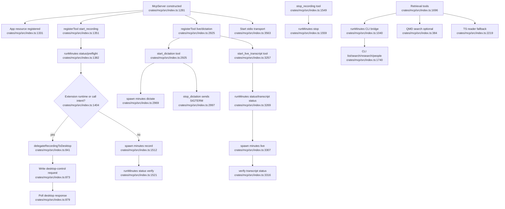

# MCP Agent Surface And CLI Delegation

## Flowchart

## Notes

- MCP is intentionally not a direct Rust API consumer. `runMinutes` keeps CLI behavior authoritative, while lightweight TS readers provide fallback.
- Call recording delegation to desktop is legitimate specialization because the desktop app has native permissions and system-audio capture.
- Dictation/live MCP spawn paths mirror CLI child process behavior, but stop semantics are inconsistent for dictation.

## Sources

- `crates/mcp/src/index.ts:784-899`
- `crates/mcp/src/index.ts:1038-1065`
- `crates/mcp/src/index.ts:1281-1544`
- `crates/mcp/src/index.ts:1549-1560`
- `crates/mcp/src/index.ts:1696-1895`
- `crates/mcp/src/index.ts:2134-2340`
- `crates/mcp/src/index.ts:2923-3022`
- `crates/mcp/src/index.ts:3255-3335`
- `crates/mcp/src/index.ts:3563-3585`
