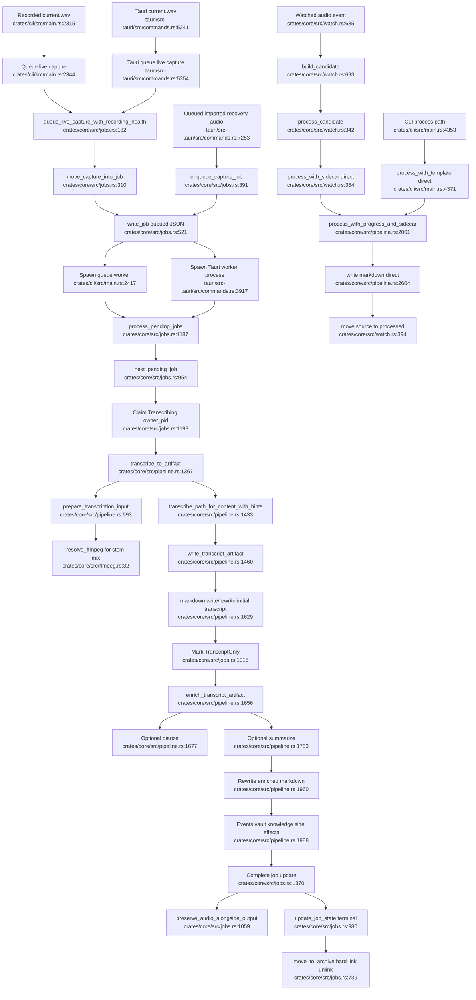

# Processing Pipeline, Background Jobs, And Watcher

## Flowchart

## Notes

- Recorded audio and Tauri retry-all enter the job queue.
- Watcher normal processing and `minutes process` call the pipeline directly without job JSON/archive state.
- The queue path preserves progress and recovery state; direct paths are simpler but duplicate pipeline lifecycle decisions.

## Sources

- `crates/core/src/jobs.rs:182-243`, `crates/core/src/jobs.rs:310-435`, `crates/core/src/jobs.rs:1187-1407`
- `crates/core/src/pipeline.rs:1367-1654`, `crates/core/src/pipeline.rs:1656-2061`, `crates/core/src/pipeline.rs:2061-2702`
- `crates/core/src/watch.rs:342-410`, `crates/core/src/watch.rs:621-757`
- `crates/cli/src/main.rs:2315-2380`, `crates/cli/src/main.rs:2417-2581`, `crates/cli/src/main.rs:4353-4379`, `crates/cli/src/main.rs:5130-5144`
- `tauri/src-tauri/src/commands.rs:3917-3945`, `tauri/src-tauri/src/commands.rs:5354-5391`, `tauri/src-tauri/src/commands.rs:7245-7361`
