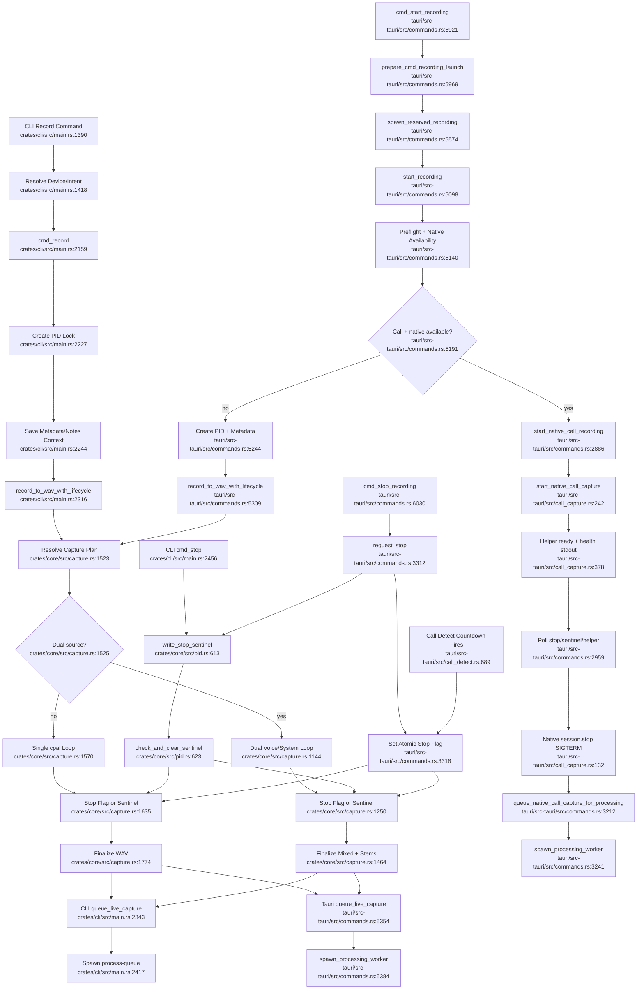

# Recording Capture And Stop Coordination

## Flowchart

## Notes

- CLI and Tauri both converge on `record_to_wav_with_lifecycle` and `queue_live_capture_with_recording_health`.
- The desktop native call branch is legitimate specialization: it owns ScreenCaptureKit/helper process state and can capture system audio without CLI loopback routing.
- Stop coordination is shared through `recording.stop` plus Tauri in-process atomics when the desktop app owns the active recording.

## Sources

- `crates/cli/src/main.rs:1390-1480`, `crates/cli/src/main.rs:2205-2534`
- `crates/core/src/capture.rs:1138-1810`
- `crates/core/src/pid.rs:23-70`, `crates/core/src/pid.rs:491-653`
- `tauri/src-tauri/src/commands.rs:2886-3270`, `tauri/src-tauri/src/commands.rs:3312-3365`, `tauri/src-tauri/src/commands.rs:5098-5650`, `tauri/src-tauri/src/commands.rs:5921-6048`
- `tauri/src-tauri/src/call_capture.rs:80-383`
- `tauri/src-tauri/src/call_detect.rs:583-714`
