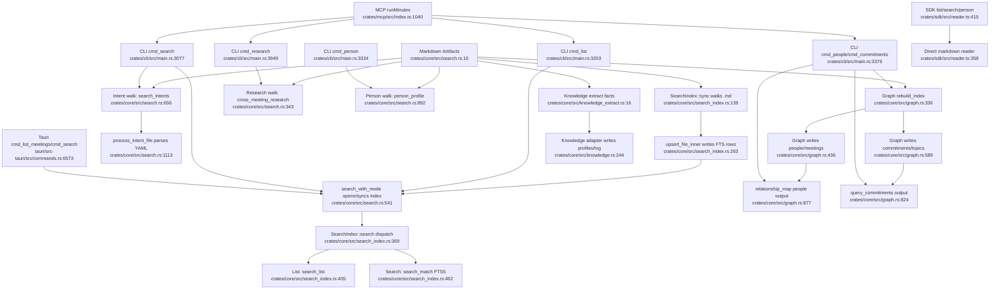

# Search, Graph, Knowledge, And Retrieval

## Flowchart

## Notes

- Search has an indexed core path and a direct markdown reader/SDK path.
- Person/commitment data is split across markdown walks (`person_profile`, `cross_meeting_research`, `search_intents`) and graph-backed queries (`relationship_map`, `query_commitments`).
- MCP uses CLI for authoritative full behavior, optional QMD for semantic search, and TS reader fallbacks when CLI is unavailable.

## Sources

- `crates/core/src/search.rs:300-1335`
- `crates/core/src/search_index.rs:1-560`
- `crates/core/src/graph.rs:336-940`
- `crates/core/src/knowledge.rs:104-385`
- `crates/core/src/knowledge_extract.rs:1-175`
- `crates/reader/src/search.rs:1-75`
- `crates/sdk/src/reader.ts:328-785`
- `crates/cli/src/main.rs:3060-3485`, `crates/cli/src/main.rs:3850-4155`
- `crates/mcp/src/index.ts:1696-1895`, `crates/mcp/src/index.ts:2134-2340`, `crates/mcp/src/index.ts:2622-2685`
- `tauri/src-tauri/src/commands.rs:6570-6660`
