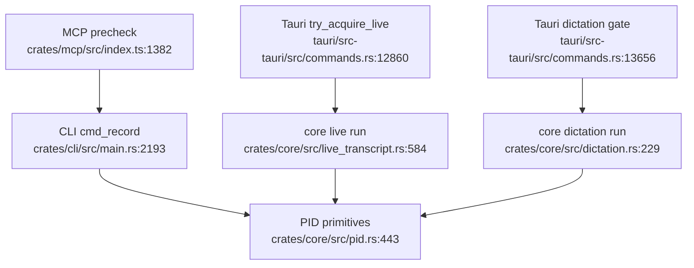
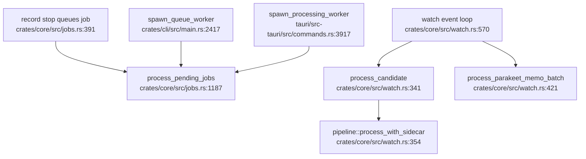

# Duplication Report

This report synthesizes the Phase 2 within-feature and cross-feature duplication passes. Each actionable claim cites at least two source locations. Some repeated concerns are marked as legitimate specialization where different trust boundaries, process owners, or output contracts justify separate paths.

## Actionable Duplications

### 1. Activity Session Policy Is Scattered

Concern: recording, live transcript, and dictation mutual exclusion is implemented separately in MCP, CLI, Tauri preflight/atomics, and core PID guards. The durable locks are necessary, but the activity conflict matrix and user-facing rejection wording drift across layers.

Evidence:
- CLI recording checks live transcript before recording PID creation: `crates/cli/src/main.rs:2193`, `crates/cli/src/main.rs:2228`
- Core dictation checks recording, live transcript, and dictation PID: `crates/core/src/dictation.rs:229`, `crates/core/src/dictation.rs:249`
- Core live transcript checks recording, dictation, and live PID: `crates/core/src/live_transcript.rs:584`, `crates/core/src/live_transcript.rs:604`
- Tauri live gate checks live, recording, and dictation: `tauri/src-tauri/src/commands.rs:12860`, `tauri/src-tauri/src/commands.rs:12874`
- Tauri dictation path performs pre-spawn gate plus permission/preflight work: `tauri/src-tauri/src/commands.rs:13656`, `tauri/src-tauri/src/commands.rs:13677`
- MCP recording/live/dictation prechecks use `minutes status` and transcript status: `crates/mcp/src/index.ts:1382`, `crates/mcp/src/index.ts:1399`, `crates/mcp/src/index.ts:2936`, `crates/mcp/src/index.ts:2948`, `crates/mcp/src/index.ts:3270`, `crates/mcp/src/index.ts:3286`
- Shared PID primitives exist but do not encode complete activity policy: `crates/core/src/pid.rs:23`, `crates/core/src/pid.rs:80`, `crates/core/src/pid.rs:443`, `crates/core/src/pid.rs:480`

Why it diverged: UI entry points need fast rejection before spawning background work; core runners need durable cross-process protection; MCP needs structured tool responses before CLI child processes are started.

Assessment: legitimate specialization at lock/UX boundaries, accidental duplication in policy. Consolidate the policy decision, keep process-specific enforcement.

### 2. Stop Coordination Repeats Around The Same Sentinel

Concern: recording and live transcript stop paths share `recording.stop`, but CLI and Tauri duplicate sentinel writing, optional SIGTERM, PID polling, and process-owner exceptions.

Evidence:
- Generic sentinel path/watch logic: `crates/core/src/pid.rs:606`, `crates/core/src/pid.rs:653`
- CLI recording stop writes sentinel, may SIGTERM, polls recording PID, reads result: `crates/cli/src/main.rs:2456`, `crates/cli/src/main.rs:2533`
- CLI live stop writes the same sentinel, may SIGTERM, polls live PID: `crates/cli/src/main.rs:2535`, `crates/cli/src/main.rs:2574`
- Tauri recording stop repeats sentinel/SIGTERM behavior: `tauri/src-tauri/src/commands.rs:3312`, `tauri/src-tauri/src/commands.rs:3352`
- Tauri live stop repeats sentinel/SIGTERM behavior: `tauri/src-tauri/src/commands.rs:12909`, `tauri/src-tauri/src/commands.rs:12933`
- MCP recording stop deliberately shells out to CLI `minutes stop`, which reaches the shared sentinel path: `crates/mcp/src/index.ts:1549`, `crates/mcp/src/index.ts:1559`
- MCP dictation stop bypasses CLI/core stop semantics and directly SIGTERMs `dictation.pid`: `crates/mcp/src/index.ts:2997`, `crates/mcp/src/index.ts:3006`
- Desktop-control is start-only today; it defines `StartRecording` but no stop action: `crates/core/src/desktop_control.rs:45`, `crates/core/src/desktop_control.rs:49`

Why it diverged: recording stop predates live transcript stop; desktop must not SIGTERM its own process; Windows PID-lock behavior forced different PID inspection in live paths.

Assessment: mostly accidental. The special cases are real, but a single core stop-request operation should own mode-aware sentinel/PID semantics. Do not add a parallel desktop-control stop protocol as the first move; preserve the current start-only desktop-control boundary and make CLI-backed stop semantics authoritative for MCP.

### 3. Processing Has Two Orchestration Lanes

Concern: captured audio and some Tauri recovery paths use durable `ProcessingJob`; watcher imports use direct pipeline calls with their own lock, processed/failed folders, events, graph rebuilds, and Parakeet batch path.

Evidence:
- Durable job model: `crates/core/src/jobs.rs:71`, `crates/core/src/jobs.rs:129`
- Queue enqueue for captured/recovery audio: `crates/core/src/jobs.rs:391`, `crates/core/src/jobs.rs:435`
- Queue worker claims jobs and calls pipeline transcription: `crates/core/src/jobs.rs:1187`, `crates/core/src/jobs.rs:1227`
- CLI queue worker spawn: `crates/cli/src/main.rs:2417`, `crates/cli/src/main.rs:2434`
- Tauri queue worker spawn: `tauri/src-tauri/src/commands.rs:3917`, `tauri/src-tauri/src/commands.rs:3945`
- Watcher lock/direct pipeline: `crates/core/src/watch.rs:63`, `crates/core/src/watch.rs:95`, `crates/core/src/watch.rs:341`, `crates/core/src/watch.rs:410`, `crates/core/src/watch.rs:570`, `crates/core/src/watch.rs:650`
- Watcher Parakeet batch direct side effects: `crates/core/src/watch.rs:420`, `crates/core/src/watch.rs:545`

Why it diverged: watcher has legitimate import concerns: settle delay, iCloud stubs, sidecars, processed/failed moves, and batch memo inference.

Assessment: mixed. Watcher discovery/settling is legitimate specialization. Bypassing shared job state, retries, worker isolation, UI status, and projection hooks is accidental.

### 4. Native Call Capture Repeats Queue Finalization Branches

Concern: `start_native_call_recording` repeats queue success/failure cleanup across early helper exit, `session.stop()` error, and normal stop completion. Each branch updates processing state, clears PID/notes, toggles recording flags, spawns worker, and sets notice/notification variants.

Evidence:
- Early helper exit queue success/failure: `tauri/src-tauri/src/commands.rs:2967`, `tauri/src-tauri/src/commands.rs:3063`
- Stop error queue success/failure: `tauri/src-tauri/src/commands.rs:3069`, `tauri/src-tauri/src/commands.rs:3172`
- Normal stop queue success/failure: `tauri/src-tauri/src/commands.rs:3212`, `tauri/src-tauri/src/commands.rs:3300`
- Lower-level state helpers nearby: `tauri/src-tauri/src/commands.rs:3529`, `tauri/src-tauri/src/commands.rs:3575`

Why it diverged: each native-call terminal condition grew its own diagnostic strings and cleanup block.

Assessment: accidental duplication. A single native-call queue finalizer can accept diagnostic context and optional source health.

### 5. Watcher Completion Side Effects Are Duplicated

Concern: single-file watcher processing and Parakeet batch processing both emit watch/memo events, rebuild graph, and move files to `processed/`, while only the transcription mechanics differ.

Evidence:
- Single-file watcher path: `crates/core/src/watch.rs:341`, `crates/core/src/watch.rs:409`
- Batch Parakeet path: `crates/core/src/watch.rs:420`, `crates/core/src/watch.rs:515`
- Shared pipeline phases used by batch: `crates/core/src/pipeline.rs:1460`, `crates/core/src/pipeline.rs:1656`

Why it diverged: Parakeet batch precomputes transcriptions and manually calls artifact write/enrich functions rather than `pipeline::process_with_sidecar`.

Assessment: accidental duplication around completion bookkeeping, legitimate specialization around batch transcription.

### 6. Corpus Parsing And Retrieval Have Parallel Layers

Concern: core search, research, intent search, graph rebuild, knowledge ingest, Rust reader, and TypeScript SDK all walk markdown/frontmatter with overlapping parsing and metadata extraction.

Evidence:
- Core indexed search and vocabulary expansion: `crates/core/src/search.rs:525`, `crates/core/src/search.rs:597`
- Core `cross_meeting_research` direct walk/parse: `crates/core/src/search.rs:343`, `crates/core/src/search.rs:430`
- Core `search_intents` direct walk/parse: `crates/core/src/search.rs:664`, `crates/core/src/search.rs:690`, `crates/core/src/search.rs:1113`, `crates/core/src/search.rs:1145`
- Search file walker and comment that legacy walkers remain after FTS migration: `crates/core/src/search.rs:11`, `crates/core/src/search.rs:30`, `crates/core/src/search.rs:1048`, `crates/core/src/search.rs:1052`
- Search-index sync and field extraction: `crates/core/src/search_index.rs:138`, `crates/core/src/search_index.rs:230`, `crates/core/src/search_index.rs:249`, `crates/core/src/search_index.rs:343`
- Search-index exclusions are centralized for sync/watch paths: `crates/core/src/search_index/exclusions.rs:1`, `crates/core/src/search_index/exclusions.rs:44`
- Graph rebuild walk and parse: `crates/core/src/graph.rs:390`, `crates/core/src/graph.rs:424`
- Knowledge ingest parse path: `crates/core/src/knowledge.rs:182`, `crates/core/src/knowledge.rs:199`
- Rust reader parser/search: `crates/reader/src/parse.rs:4`, `crates/reader/src/parse.rs:42`, `crates/reader/src/search.rs:7`, `crates/reader/src/search.rs:37`
- TypeScript SDK search: `crates/sdk/src/reader.ts:434`, `crates/sdk/src/reader.ts:459`

Why it diverged: FTS migration was incremental; SDK/reader crates have packaging/runtime constraints and cannot always call Rust core.

Assessment: core-side scanner/parser drift is accidental. SDK/reader duplication is partly legitimate packaging specialization but should be contract-tested against the core parser. There is also a correctness risk: graph rebuild does not appear to share the search-index exclusion predicate, so graph and search can disagree if excluded markdown directories such as `archive`, `processed`, or `failed` exist under `config.output_dir`.

### 7. Graph/Projection Refresh Is Manually Repeated

Concern: graph rebuilds are called from multiple mutation sites instead of one post-artifact/projection invalidation hook.

Evidence:
- Watcher single-file graph rebuild: `crates/core/src/watch.rs:389`, `crates/core/src/watch.rs:394`
- Watcher Parakeet batch graph rebuild: `crates/core/src/watch.rs:508`, `crates/core/src/watch.rs:511`
- CLI stop graph rebuild after recording result: `crates/cli/src/main.rs:2512`, `crates/cli/src/main.rs:2515`
- CLI process graph rebuild: `crates/cli/src/main.rs:4370`, `crates/cli/src/main.rs:4385`
- Tauri speaker confirmation graph rebuild: `tauri/src-tauri/src/commands.rs:7713`, `tauri/src-tauri/src/commands.rs:7726`
- Tauri vocabulary save graph rebuild: `tauri/src-tauri/src/commands.rs:7782`, `tauri/src-tauri/src/commands.rs:7792`
- Pipeline emits processed/knowledge events but does not own graph projection refresh: `crates/core/src/pipeline.rs:2030`, `crates/core/src/pipeline.rs:2056`, `crates/core/src/pipeline.rs:2681`, `crates/core/src/pipeline.rs:2685`

Why it diverged: projections grew feature-by-feature. Pipeline owns artifact writing and knowledge updates; graph stayed in callers.

Assessment: accidental. Missed and redundant rebuilds are likely as more artifact mutations are added.

### 8. Search Index SQL Filter Construction Is Duplicated

Concern: `search_list` and `search_match` duplicate filter clauses and argument building for content type, dates, recorded-by, and attendee.

Evidence:
- `search_list`: `crates/core/src/search_index.rs:406`, `crates/core/src/search_index.rs:459`
- `search_match`: `crates/core/src/search_index.rs:461`, `crates/core/src/search_index.rs:525`

Why it diverged: empty query uses B-tree listing; non-empty query uses FTS5 `MATCH`.

Assessment: accidental duplication in common filter construction. Keep the two search modes; share filter append logic.

### 9. Desktop Shortcut Migration Is Incomplete

Concern: old Tauri command setters and global shortcut fallback paths coexist with the newer `ShortcutManager` slot/state-machine model.

Evidence:
- Legacy global-shortcut fallback dispatch: `tauri/src-tauri/src/main.rs:1489`, `tauri/src-tauri/src/main.rs:1586`
- New shortcut state machine/action execution: `tauri/src-tauri/src/shortcut_manager.rs:95`, `tauri/src-tauri/src/shortcut_manager.rs:213`, `tauri/src-tauri/src/shortcut_manager.rs:667`, `tauri/src-tauri/src/shortcut_manager.rs:740`
- `cmd_set_global_hotkey`: `tauri/src-tauri/src/commands.rs:7031`, `tauri/src-tauri/src/commands.rs:7070`
- `cmd_set_dictation_shortcut`: `tauri/src-tauri/src/commands.rs:7073`, `tauri/src-tauri/src/commands.rs:7135`

Why it diverged: migration from per-feature shortcut handlers to unified slots is incomplete.

Assessment: accidental migration residue. Remove only after confirming UI callers can use `cmd_set_shortcut`.

### 10. MCP Recording Response Shaping Is Duplicated

Concern: MCP `start_recording` has separate desktop-delegated and direct-spawn branches, each verifies status and shapes recording/live-transcript response text.

Evidence:
- Desktop-control TypeScript protocol: `crates/mcp/src/index.ts:784`, `crates/mcp/src/index.ts:899`
- Shared CLI helper: `crates/mcp/src/index.ts:1038`, `crates/mcp/src/index.ts:1058`
- Desktop delegation branch: `crates/mcp/src/index.ts:1378`, `crates/mcp/src/index.ts:1485`
- Direct spawn branch: `crates/mcp/src/index.ts:1499`, `crates/mcp/src/index.ts:1544`
- Rust desktop-control protocol: `crates/core/src/desktop_control.rs:9`, `crates/core/src/desktop_control.rs:197`

Why it diverged: MCP extension runtime cannot reliably inherit mic permissions, so recording must choose desktop delegation or CLI child process.

Assessment: transport selection is legitimate; post-start status/live-response shaping is accidental duplication.

### 11. Recording Launch Policy Is Re-Exposed By Every Surface

Concern: CLI, Tauri command RPC, palette, MCP, and desktop-control RPC each owns part of “how should this start-recording request be routed/preflighted?”.

Evidence:
- Desktop RPC request schema supports `StartRecording`: `crates/core/src/desktop_control.rs:32`, `crates/core/src/desktop_control.rs:64`
- Desktop heartbeat/pending request loop: `tauri/src-tauri/src/main.rs:2332`, `tauri/src-tauri/src/main.rs:2358`
- Tauri desktop RPC calls `launch_recording`: `tauri/src-tauri/src/commands.rs:5626`, `tauri/src-tauri/src/commands.rs:5655`
- Palette registry defines start/stop/live/dictation actions: `crates/core/src/palette.rs:77`, `crates/core/src/palette.rs:115`
- Palette dispatch preflights before `cmd_start_recording`: `tauri/src-tauri/src/palette_dispatch.rs:397`, `tauri/src-tauri/src/palette_dispatch.rs:459`
- MCP delegates call/extension recording to desktop, otherwise spawns CLI: `crates/mcp/src/index.ts:1400`, `crates/mcp/src/index.ts:1445`, `crates/mcp/src/index.ts:1499`, `crates/mcp/src/index.ts:1518`
- CLI `cmd_record` owns consent/PID/context setup: `crates/cli/src/main.rs:2159`, `crates/cli/src/main.rs:2255`

Why it diverged: separate product surfaces are legitimate. The duplicated part is launch policy and preflight expectations.

Assessment: legitimate surfaces, accidental policy drift. A core launch planner should return the same routing/preflight decision to all surfaces.

### 12. Desktop Update Active-Session Gating Is Repeated

Concern: desktop update check, deferred update surfacing, and update install repeat their own “any active session?” predicates instead of sharing one desktop-local readiness check.

Evidence:
- Auto update check defers notification when Tauri atomics indicate recording/live/dictation is active: `tauri/src-tauri/src/main.rs:776`, `tauri/src-tauri/src/main.rs:804`
- Deferred update surfacing repeats the active-session predicate: `tauri/src-tauri/src/commands.rs:1030`, `tauri/src-tauri/src/commands.rs:1050`
- Update install repeats the active-session gate and adds a macOS CLI recording check: `tauri/src-tauri/src/commands.rs:14048`, `tauri/src-tauri/src/commands.rs:14069`
- The update lifecycle itself remains desktop-specific: `tauri/src-tauri/src/main.rs:719`, `tauri/src-tauri/src/commands.rs:14093`, `tauri/src/index.html:11198`

Why it diverged: update notification, UI surfacing, and install grew as separate desktop flows that each needed a local safety check.

Assessment: accidental duplication inside a legitimate desktop-only subsystem. Share the active-session predicate within Tauri update code; do not move updater lifecycle into core.

### 13. MCP Is A CLI Bridge, Not A Third Core Link

Concern: architecture discussions can overstate MCP as a third static `minutes-core` consumer. That framing hides the actual duplication: MCP shells out to CLI for core-backed behavior while keeping some TypeScript read-only parsing/search fallback.

Evidence:
- CLI links `minutes-core` directly through Cargo: `crates/cli/Cargo.toml:14`, `crates/cli/src/main.rs:1358`
- Tauri links `minutes-core` directly through Cargo: `tauri/src-tauri/Cargo.toml:25`, `tauri/src-tauri/src/main.rs:2449`
- MCP package depends on MCP SDK and `minutes-sdk`, not Rust core bindings: `crates/mcp/package.json:42`, `crates/mcp/package.json:48`
- MCP runs authoritative behavior through `execFile`/`spawn` of the `minutes` binary: `crates/mcp/src/index.ts:1038`, `crates/mcp/src/index.ts:1512`, `crates/mcp/src/index.ts:2969`, `crates/mcp/src/index.ts:3307`
- TypeScript SDK reader implements read-only markdown listing/search fallback: `crates/sdk/src/reader.ts:415`, `crates/sdk/src/reader.ts:434`

Why it diverged: MCP runs in Node/MCP client environments, so direct Rust core linkage is not the current packaging model.

Assessment: not a bug by itself. Treat MCP as a transport/bridge specialization. Consolidate policy by exposing CLI JSON preflights backed by core, and contract-test TypeScript reader semantics against core scanner fixtures where practical.

## Legitimate Specialization / Non-Findings

- Native desktop call capture should not be collapsed into CLI capture. It has bundle identity, ScreenCaptureKit helper ownership, source health, and system-audio capture that the CLI does not have.
- `queue_live_capture_with_recording_health` and `enqueue_capture_job` have different file ownership semantics. They can share a job constructor, but active-capture move semantics and in-place recovery semantics should remain separate.
- Direct `minutes process` is a legitimate foreground command path. It should not be forced into the background queue unless the product explicitly changes command semantics.
- MCP desktop-control file protocol is legitimate cross-process coordination. The TypeScript side can share schema/response shaping, but it cannot simply link Rust core.
- MCP itself is not a static `minutes-core` consumer. It should stay a CLI bridge plus TypeScript read-only fallback unless the packaging model intentionally changes.
- Knowledge adapters have different output contracts. `ObsidianAdapter` already delegates to `WikiAdapter` where appropriate.
- Process spawning mechanisms are not all the same: MCP noninteractive CLI calls, queue worker isolation, and Recall PTY have different I/O/lifecycle needs. Shared policy helpers are safer than one universal spawn abstraction.
- Tauri updater download, signature verification, progress events, and restart are desktop-only concerns. Only the repeated active-session predicate should be consolidated.
