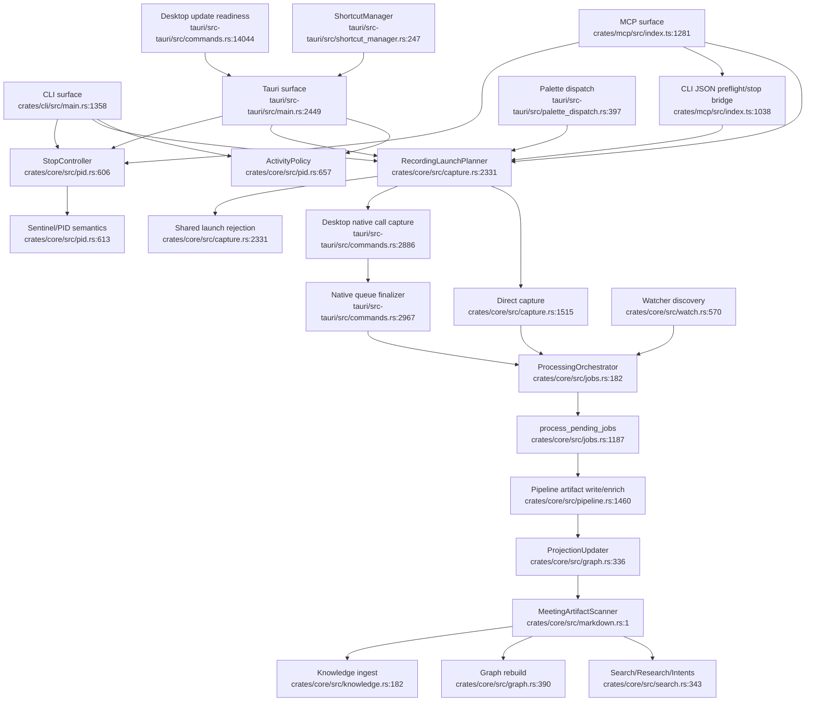

# Unified Proposal

This proposal keeps the current product distinction intact: `minutes-core` remains the shared Rust engine; CLI and Tauri link it directly; MCP remains a Node server that shells out to the CLI for authoritative core-backed behavior and keeps TypeScript read-only fallbacks where needed. Desktop-native call capture remains desktop-owned. The goal is to remove policy drift and duplicated lifecycle bookkeeping, not to add a broad abstraction layer.

## 1. Add A Core Activity Policy

Consolidated component: `ActivityPolicy`

Single entry point: `minutes_core::pid::activity_conflicts(request: ActivityRequest) -> ActivityDecision`

Target location: new code near `crates/core/src/pid.rs:657`, because the current durable activity state and status aggregation already live in `pid.rs`.

What it owns:
- Which activities conflict: recording, standalone live transcript, dictation, processing where relevant.
- Stable user-facing reasons for “cannot start”.
- Optional advisory detail for UI surfaces.
- No file writes and no locks. It is a policy/read decision only.

Old call sites become:
- `crates/cli/src/main.rs:2193` and `crates/cli/src/main.rs:2228` call `activity_conflicts(ActivityRequest::StartRecording)` before `pid::create()`.
- `crates/core/src/dictation.rs:229` and `crates/core/src/dictation.rs:249` call the same policy before acquiring `dictation.pid`, then still acquire the PID for durable enforcement.
- `crates/core/src/live_transcript.rs:584` and `crates/core/src/live_transcript.rs:604` call the policy before acquiring `live-transcript.pid`.
- `tauri/src-tauri/src/commands.rs:12860` and `tauri/src-tauri/src/commands.rs:12874` use the policy for live preflight, then keep the Tauri atomic guard.
- `tauri/src-tauri/src/commands.rs:13656` and `tauri/src-tauri/src/commands.rs:13677` use the policy for dictation preflight, then keep focus/permission setup.
- `crates/mcp/src/index.ts:1382`, `crates/mcp/src/index.ts:2936`, and `crates/mcp/src/index.ts:3270` keep CLI status checks only until the CLI exposes a JSON preflight that uses the core policy.

Loss of capability: none. This is a read-only policy centralization; locks and surface-specific UX remain.

Anti-pattern rejected: a registry of activities. An enum and a match are enough.

## 2. Add A Core Stop Controller

Consolidated component: `StopController`

Single entry point: `minutes_core::pid::request_activity_stop(target: StopTarget, owner: StopOwner) -> StopRequestResult`

Target location: `crates/core/src/pid.rs:606`, next to sentinel helpers.

What it owns:
- Resolve PID path for recording vs standalone live transcript vs dictation if dictation stop is added.
- Write sentinel when appropriate.
- Decide whether SIGTERM is appropriate based on process owner and desktop ownership.
- Return a poll target and mode-specific result metadata.

Old call sites become:
- `crates/cli/src/main.rs:2456` and `crates/cli/src/main.rs:2535` call `request_activity_stop` and use returned poll target/output behavior.
- `tauri/src-tauri/src/commands.rs:3312` calls it for out-of-process recording stops, while keeping direct `stop_flag` for in-process Tauri recording.
- `tauri/src-tauri/src/commands.rs:12909` calls it for out-of-process live transcript stops, while keeping direct `live_transcript_stop_flag` for in-process live.
- `crates/mcp/src/index.ts:1549` continues to route recording stop through CLI `minutes stop`, which should become backed by `request_activity_stop`.
- `crates/mcp/src/index.ts:2997` should stop shelling out to raw PID/SIGTERM for dictation; it should call a CLI stop command backed by `request_activity_stop(StopTarget::Dictation, ...)` once exposed.

Loss of capability: none. The Tauri in-process fast path remains.

Boundary to preserve: desktop-control currently defines start recording only at `crates/core/src/desktop_control.rs:45`. Do not introduce a parallel desktop-control stop protocol before consolidating the existing CLI/sentinel semantics.

Anti-pattern rejected: reusing `recording.stop` for every activity without mode metadata forever. The helper can keep current sentinel behavior initially, but the call sites stop encoding it.

## 3. Route Watcher Processing Through Job Semantics

Consolidated component: `ProcessingOrchestrator`

Single entry point: `minutes_core::jobs::enqueue_processing_job(input: ProcessingInput) -> ProcessingJob`

Target location: replace the current split around `crates/core/src/jobs.rs:182` and `crates/core/src/jobs.rs:391`.

What it owns:
- One queued job constructor.
- Input ownership variants:
  - `MoveCapture { current_wav, ... }`
  - `ExistingAudio { audio_path, ... }`
  - `WatchedAudio { original_path, sidecar, move_policy, ... }`
- Shared terminal projection hooks.
- Still allows direct foreground `minutes process`.

Old call sites become:
- `queue_live_capture_with_recording_health` at `crates/core/src/jobs.rs:182` becomes a thin wrapper or is replaced by `enqueue_processing_job(ProcessingInput::MoveCapture)`.
- `enqueue_capture_job` at `crates/core/src/jobs.rs:391` becomes `enqueue_processing_job(ProcessingInput::ExistingAudio)`.
- Watcher `process_candidate` at `crates/core/src/watch.rs:341` queues `ProcessingInput::WatchedAudio` instead of calling `pipeline::process_with_sidecar` directly.
- Watcher Parakeet batch at `crates/core/src/watch.rs:420` keeps its batch transcription specialization, but uses the same watcher completion/projection helper after artifact write/enrich.
- Tauri retry-all at `tauri/src-tauri/src/commands.rs:7245` continues to enqueue existing audio through the unified entry.
- Direct CLI `process` at `crates/cli/src/main.rs:4353` stays direct foreground execution.

Loss of capability: watcher “processed/failed” file moves must be preserved through `WatchedAudio.move_policy`; no user-visible capability should be lost.

Anti-pattern rejected: forcing `minutes process` into the background queue. That would change terminal semantics.

## 4. Add A Meeting Artifact Scanner And Projection Hook

Consolidated components:
- `MeetingArtifactScanner`
- `ProjectionUpdater`

Single entry points:
- `minutes_core::markdown::scan_meeting_artifacts(config, options) -> impl Iterator<Item = ParsedMeetingArtifact>`
- `minutes_core::graph::refresh_after_artifact_change(config, reason, paths) -> Result<(), GraphError>`

Target locations:
- Scanner near existing markdown utilities, around `crates/core/src/markdown.rs` and call sites now starting at `crates/core/src/search.rs:11`.
- Projection hook near `crates/core/src/graph.rs:336`, where rebuild logic already exists.

What it owns:
- One core walker/parser for markdown artifacts: path, frontmatter, body, content type, dates, attendees, speaker overlays hook.
- One shared exclusion policy for archive/processed/failed and any other non-corpus markdown paths.
- Core search/research/intents/graph/knowledge use the same parsed artifact view.
- One projection refresh/invalidation hook after artifact writes, overlay changes, and vocabulary changes.

Old call sites become:
- `crates/core/src/search.rs:343`, `crates/core/src/search.rs:664`, and `crates/core/src/search.rs:1113` consume `ParsedMeetingArtifact` instead of hand-reading files.
- `crates/core/src/search_index.rs:138` uses the scanner for sync input but keeps FTS-specific writes.
- `crates/core/src/graph.rs:390` uses the scanner for rebuild input but keeps graph-specific writes, so graph and search share corpus membership/exclusion semantics.
- `crates/core/src/knowledge.rs:182` uses the scanner/parser for ingest.
- Graph rebuild calls at `crates/core/src/watch.rs:389`, `crates/core/src/watch.rs:508`, `crates/cli/src/main.rs:2512`, `crates/cli/src/main.rs:4370`, `tauri/src-tauri/src/commands.rs:7713`, and `tauri/src-tauri/src/commands.rs:7782` become `ProjectionUpdater` calls or disappear when pipeline/job completion owns refresh.
- `crates/reader` and `crates/sdk` remain separate packages, but add contract tests against scanner fixtures so packaging specialization does not silently drift.

Loss of capability: none. FTS, graph, knowledge, SDK, and reader keep their storage/output models.

Correctness issue addressed: graph rebuild currently appears to walk markdown separately from the search-index exclusion predicate, so graph and search can drift if excluded markdown directories such as `archive`, `processed`, or `failed` exist under `config.output_dir`.

Anti-pattern rejected: making graph/search/knowledge share one storage backend. They answer different queries and should keep specialized stores.

## 5. Add A Recording Launch Planner

Consolidated component: `RecordingLaunchPlanner`

Single entry point: `minutes_core::capture::plan_recording_launch(request: RecordingLaunchRequest, surface: RecordingSurface) -> RecordingLaunchPlan`

Target location: near capture preflight, around `crates/core/src/capture.rs:2331`.

What it owns:
- Intent inference.
- Call-aware preflight result.
- Whether the current surface should record directly, reject, or delegate to desktop.
- Stable warning/blocking text for surfaces.

Old call sites become:
- CLI `cmd_record` at `crates/cli/src/main.rs:2159` asks planner for direct record/reject decisions before PID setup.
- Tauri `cmd_start_recording` and `launch_recording` around `tauri/src-tauri/src/commands.rs:5921` and `tauri/src-tauri/src/commands.rs:5529` ask planner but can still execute native desktop capture.
- Palette dispatch at `tauri/src-tauri/src/palette_dispatch.rs:397` stops doing its own preflight policy and asks Tauri recording command/planner.
- MCP `start_recording` at `crates/mcp/src/index.ts:1400` should call a CLI JSON preflight backed by the planner, then choose desktop-control delegation or direct spawn; MCP does not link the planner directly.
- Desktop RPC `handle_desktop_control_request` at `tauri/src-tauri/src/commands.rs:5626` uses the same plan before accepting.

Loss of capability: none. Desktop native call capture remains a planner outcome; CLI degraded/loopback behavior remains a direct outcome.

Anti-pattern rejected: one recording executor for all surfaces. The surfaces have different process ownership and permission boundaries.

## 6. Finish ShortcutManager Migration

Consolidated component: existing `ShortcutManager`

Single entry point: `tauri/src-tauri/src/shortcut_manager.rs:247` via `cmd_set_shortcut`

Target location: keep `ShortcutManager`; delete legacy setters after callers move.

What it owns:
- Registration/update/rollback for global, dictation, live, and palette slots.
- Shortcut status and action dispatch.

Old call sites become:
- `cmd_set_global_hotkey` at `tauri/src-tauri/src/commands.rs:7031` becomes a compatibility wrapper around `cmd_set_shortcut`.
- `cmd_set_dictation_shortcut` at `tauri/src-tauri/src/commands.rs:7073` becomes a compatibility wrapper around `cmd_set_shortcut`.
- Legacy global fallback path at `tauri/src-tauri/src/main.rs:1489` is removed only after all slots are registered through `ShortcutManager`.
- `tauri/src-tauri/src/shortcut_manager.rs:667` remains the action dispatch entry.

Loss of capability: none, if wrappers preserve current settings UI contracts during migration.

Anti-pattern rejected: keeping both systems indefinitely behind feature flags.

## 7. Add Small Finalizers For Known Branch Duplication

Consolidated components:
- `finish_native_call_capture_queue_result`
- `finish_watcher_processed_artifact`
- `format_mcp_recording_started_response`

Single entry points:
- `tauri/src-tauri/src/commands.rs` near native call helpers around `tauri/src-tauri/src/commands.rs:2886`
- `crates/core/src/watch.rs` near `process_candidate` around `crates/core/src/watch.rs:341`
- `crates/mcp/src/index.ts` near `start_recording` around `crates/mcp/src/index.ts:1378`

What they own:
- Repeated cleanup/bookkeeping only.
- No transport or capture behavior.

Old call sites become:
- Native call branches at `tauri/src-tauri/src/commands.rs:2967`, `tauri/src-tauri/src/commands.rs:3069`, and `tauri/src-tauri/src/commands.rs:3212` call one finalizer.
- Watcher single and batch completions at `crates/core/src/watch.rs:370` and `crates/core/src/watch.rs:495` call one completion helper.
- MCP desktop and direct recording branches at `crates/mcp/src/index.ts:1435` and `crates/mcp/src/index.ts:1521` call one response helper after accepted start.

Loss of capability: none. These are local cleanups.

Anti-pattern rejected: creating a cross-crate “lifecycle framework” for three local finalizers.

## 8. Share Desktop Update Active-Session Gating

Consolidated component: `DesktopUpdateReadiness`

Single entry point: a Tauri-local helper such as `desktop_update_blocker(app_state) -> Option<String>`

Target location: `tauri/src-tauri/src/commands.rs` or `tauri/src-tauri/src/main.rs`, close to the existing update helpers around `tauri/src-tauri/src/main.rs:719` and `tauri/src-tauri/src/commands.rs:14044`.

What it owns:
- The desktop-local predicate for whether recording, live transcript, dictation, or an external CLI-owned recording should defer update surfacing/install.
- Stable reason text for why update installation is blocked.
- No update download, signature verification, restart, or UI event behavior.

Old call sites become:
- Auto-update notification deferral at `tauri/src-tauri/src/main.rs:776` calls the shared predicate.
- Deferred update surfacing at `tauri/src-tauri/src/commands.rs:1030` calls the shared predicate.
- Update installation at `tauri/src-tauri/src/commands.rs:14048` calls the shared predicate.

Loss of capability: none. This is desktop-local predicate consolidation.

Anti-pattern rejected: moving updater lifecycle into core. The updater is a Tauri product concern.

## Proposed Unified Flow

## Recommended Order

1. Core activity policy and stop controller. These reduce correctness drift in active session behavior.
2. Projection hook and meeting artifact scanner. These reduce missed graph/search drift and unlock cleaner retrieval work.
3. Processing orchestrator for watcher queueing. This has larger behavioral surface and should follow the projection hook.
4. Recording launch planner. This touches all surfaces and should be done after activity policy is stable.
5. Shortcut migration, local finalizers, and desktop update readiness. These are useful cleanup slices with smaller blast radius.
