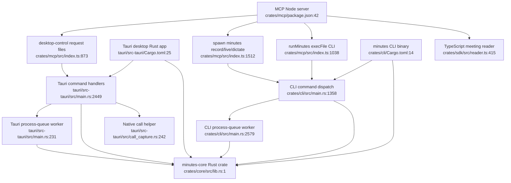

# Final Synthesized Pathfinder Audit

Date: 2026-06-21

This is the source-verified synthesis for the Minutes Pathfinder audit. It uses the existing Pathfinder artifacts in this directory as scaffolding, but the conclusions below are based on re-checking the implementation in the current checkout.

## Executive Summary

Minutes is best understood as three product surfaces over one Rust engine, not as three equal static copies of `minutes-core`.

- The CLI links `minutes-core` directly through Cargo and calls it in-process: `crates/cli/Cargo.toml:14`, `crates/cli/src/main.rs:1358`, `crates/cli/src/main.rs:2316`.
- The Tauri desktop app also links `minutes-core` directly and calls it in-process: `tauri/src-tauri/Cargo.toml:25`, `tauri/src-tauri/src/main.rs:2449`, `tauri/src-tauri/src/commands.rs:5309`.
- The MCP server does not link `minutes-core`. It is a Node package that shells out to the `minutes` CLI for authoritative behavior and uses TypeScript readers for some read-only fallback paths: `crates/mcp/package.json:42`, `crates/mcp/src/index.ts:1038`, `crates/mcp/src/index.ts:1512`, `crates/sdk/src/reader.ts:415`.

The architecture problem is therefore not "core is replicated three times." The real problem is that policy and lifecycle decisions are reassembled around the core by every surface. The durable state is centralized under `~/.minutes`, but the decisions about when to start, reject, stop, queue, refresh, and format status are scattered across CLI, Tauri, MCP, and some core modules.

The previous Pathfinder outputs are broadly directionally correct. The final audit adds these corrections:

- MCP should be described as a CLI bridge plus TypeScript read fallback, not a third static `minutes-core` consumer.
- Desktop-control is start-only today. Stop still flows through `minutes stop` and shared sentinel/PID behavior.
- Watcher processing bypasses job JSON, `processing-status.json`, terminal job archive state, and QMD refresh.
- Graph rebuild does not appear to share the search exclusion predicate, so graph and search can drift if excluded markdown directories exist under the output tree.
- Update gating has another desktop-only duplicated predicate: "any active session" is repeated in update check, surfacing, and install paths.

## Current Runtime Shape

## Highest-Value Unification Targets

### 1. Core activity policy

Current state: activity conflict checks exist in several places around the same PID truth.

Evidence:

- CLI recording checks active live transcript before recording start: `crates/cli/src/main.rs:2193`.
- Core dictation rejects recording/live/dictation conflicts: `crates/core/src/dictation.rs:229`, `crates/core/src/dictation.rs:248`.
- Core live rejects recording/dictation and acquires `live-transcript.pid`: `crates/core/src/live_transcript.rs:584`, `crates/core/src/live_transcript.rs:604`.
- Tauri repeats live/dictation gates: `tauri/src-tauri/src/commands.rs:12832`, `tauri/src-tauri/src/commands.rs:12874`.
- MCP repeats partial checks using `minutes status` and transcript status: `crates/mcp/src/index.ts:2936`, `crates/mcp/src/index.ts:3268`.

Recommendation: add a read-only `ActivityPolicy` in core, close to `pid.rs`, that returns conflict decisions and stable rejection reasons. Keep PID files and Tauri atomics as enforcement. Do not turn this into a registry; an enum plus match is enough.

### 2. Core stop controller

Current state: stop semantics share the sentinel but duplicate mode-aware behavior.

Evidence:

- Core only provides sentinel primitives today: `crates/core/src/pid.rs:606`, `crates/core/src/pid.rs:653`.
- CLI `cmd_stop` writes `recording.stop`, avoids killing desktop-owned PID, and polls PID removal: `crates/cli/src/main.rs:2465`, `crates/cli/src/main.rs:2471`, `crates/cli/src/main.rs:2494`.
- Tauri recording stop repeats sentinel/SIGTERM/desktop-owner behavior: `tauri/src-tauri/src/commands.rs:3312`, `tauri/src-tauri/src/commands.rs:3353`.
- Tauri live stop repeats the same shape: `tauri/src-tauri/src/commands.rs:12909`, `tauri/src-tauri/src/commands.rs:12933`.
- MCP dictation stop bypasses CLI/core stop semantics and directly SIGTERMs `dictation.pid`: `crates/mcp/src/index.ts:2997`, `crates/mcp/src/index.ts:3006`.

Recommendation: add one core `request_activity_stop(target, owner)` helper that owns sentinel selection, PID inspection, desktop-owner exception, optional SIGTERM, and poll metadata. Preserve Tauri in-process atomic stop paths. Do not introduce desktop-control stop first; desktop-control is start-only today and `minutes stop` already reaches the shared sentinel path.

### 3. Processing orchestrator for watcher/import paths

Current state: captured/recovery audio uses durable jobs; watched audio bypasses jobs and repeats terminal bookkeeping.

Evidence:

- Job queue records active captures as job JSON and moves audio into `~/.minutes/jobs`: `crates/core/src/jobs.rs:182`, `crates/core/src/jobs.rs:310`, `crates/core/src/jobs.rs:521`.
- Job workers claim jobs, run transcription/enrichment, archive terminal state, rebuild graph, refresh QMD, and preserve audio: `crates/core/src/jobs.rs:1187`, `crates/core/src/jobs.rs:1370`, `crates/core/src/jobs.rs:1394`, `crates/core/src/jobs.rs:1059`.
- Watcher owns file discovery/settling and calls the pipeline directly: `crates/core/src/watch.rs:570`, `crates/core/src/watch.rs:693`, `crates/core/src/watch.rs:341`, `crates/core/src/watch.rs:354`.
- Watcher success/failure does its own graph rebuild and processed/failed moves: `crates/core/src/watch.rs:389`, `crates/core/src/watch.rs:394`.
- Parakeet batch watcher path separately emits events, rebuilds graph, and moves files: `crates/core/src/watch.rs:420`, `crates/core/src/watch.rs:508`, `crates/core/src/watch.rs:545`.

Recommendation: keep watcher discovery, iCloud stub handling, sidecars, and processed/failed moves as specialization. Route watcher terminal processing through shared job semantics or, at minimum, a shared terminal completion/projection helper. Do not change foreground `minutes process` semantics.

### 4. Meeting artifact scanner and projection updater

Current state: search, graph, research, intents, and knowledge all parse markdown artifacts in overlapping ways.

Evidence:

- FTS search sync walks markdown with shared exclusions: `crates/core/src/search_index.rs:139`, `crates/core/src/search_index/exclusions.rs:1`.
- Cross-meeting research walks/parses markdown directly: `crates/core/src/search.rs:343`, `crates/core/src/search.rs:371`.
- Intent search walks/parses markdown directly: `crates/core/src/search.rs:664`, `crates/core/src/search.rs:1113`.
- Graph rebuild walks markdown and parses frontmatter separately: `crates/core/src/graph.rs:390`, `crates/core/src/graph.rs:410`.
- Knowledge ingest reads/parses one markdown file separately: `crates/core/src/knowledge.rs:182`, `crates/core/src/knowledge.rs:199`.
- Manual graph refresh calls exist at several mutation sites: `crates/core/src/watch.rs:389`, `crates/core/src/watch.rs:508`, `crates/cli/src/main.rs:2512`, `crates/cli/src/main.rs:4370`, `tauri/src-tauri/src/commands.rs:7713`, `tauri/src-tauri/src/commands.rs:7782`.

Recommendation: add a core artifact scanner that owns file walking, exclusions, frontmatter/body parsing, content type, dates, attendees, and path metadata. Add a projection updater that owns graph invalidation/rebuild after artifact writes, overlay changes, and vocabulary changes. Keep search, graph, knowledge, SDK, and reader storage/output models separate.

Correctness risk: graph rebuild does not appear to reuse the search exclusion predicate. If `archive`, `processed`, or `failed` directories exist under `config.output_dir`, graph and search can disagree about corpus membership.

### 5. Recording launch planner

Current state: launch routing is reconstructed by CLI, Tauri command RPC, palette, MCP, and desktop-control.

Evidence:

- Core already owns native-aware capture preflight: `crates/core/src/capture.rs:2331`, `crates/core/src/capture.rs:2399`, `crates/core/src/capture.rs:2460`.
- CLI consumes core preflight before recording: `crates/cli/src/main.rs:2176`, `crates/cli/src/main.rs:2184`.
- Tauri adds validation, consent, reservation, and spawn orchestration: `tauri/src-tauri/src/commands.rs:5954`, `tauri/src-tauri/src/commands.rs:5972`.
- Palette does its own synchronous recording preflight before calling the recording command: `tauri/src-tauri/src/palette_dispatch.rs:421`, `tauri/src-tauri/src/palette_dispatch.rs:459`.
- MCP does status, CLI preflight, desktop delegation, and direct spawn routing: `crates/mcp/src/index.ts:1382`, `crates/mcp/src/index.ts:1395`, `crates/mcp/src/index.ts:1404`, `crates/mcp/src/index.ts:1512`.
- Desktop-control defines start recording only: `crates/core/src/desktop_control.rs:45`, `crates/core/src/desktop_control.rs:49`.

Recommendation: add a core launch planner that returns direct/reject/delegate guidance and stable warning/blocking text. It should not execute recording. Tauri native call capture remains a desktop-only executor; CLI degraded/loopback behavior remains a CLI executor; MCP remains a CLI bridge.

### 6. Desktop-only cleanup targets

These are real, but lower priority than cross-surface lifecycle policy.

- Finish `ShortcutManager` migration: `tauri/src-tauri/src/shortcut_manager.rs:95`, `tauri/src-tauri/src/shortcut_manager.rs:667`, `tauri/src-tauri/src/main.rs:1489`, `tauri/src-tauri/src/commands.rs:7031`.
- Centralize desktop update "active session" predicates inside Tauri update code: `tauri/src-tauri/src/main.rs:776`, `tauri/src-tauri/src/commands.rs:1030`, `tauri/src-tauri/src/commands.rs:14048`.
- Extract local finalizers for native call queue cleanup, watcher completion bookkeeping, and MCP recording-started response formatting: `tauri/src-tauri/src/commands.rs:2967`, `tauri/src-tauri/src/commands.rs:3069`, `tauri/src-tauri/src/commands.rs:3212`, `crates/mcp/src/index.ts:1435`, `crates/mcp/src/index.ts:1521`.

## What Should Not Be Unified

Do not collapse these into generic shared abstractions:

- Desktop-native call capture. It has ScreenCaptureKit/helper ownership, bundle identity, source health, and macOS permission behavior: `tauri/src-tauri/src/commands.rs:2877`, `tauri/src-tauri/src/call_capture.rs:242`.
- MCP desktop-control delegation. It is a process/TCC boundary, not just transport duplication: `crates/core/src/desktop_control.rs:9`, `tauri/src-tauri/src/main.rs:2332`, `crates/mcp/src/index.ts:841`.
- Recall PTY and assistant workspace. This is desktop UI/process orchestration, not core lifecycle policy: `tauri/src-tauri/src/commands.rs:8213`, `tauri/src-tauri/src/context.rs:174`, `tauri/src-tauri/src/pty.rs:87`.
- Foreground `minutes process`. It is a terminal command with different user expectations from background processing: `crates/cli/src/main.rs:4353`.
- Search, graph, and knowledge storage backends. They answer different query shapes; the shared part should be artifact scanning/projection invalidation, not one universal store.

## Recommended Refactor Order

1. Add `ActivityPolicy`.
2. Add `request_activity_stop`.
3. Add `MeetingArtifactScanner` and `ProjectionUpdater`.
4. Route watcher completion through job/projection semantics.
5. Add `RecordingLaunchPlanner`.
6. Finish `ShortcutManager` migration.
7. Extract the small local finalizers.
8. Clean up desktop update active-session predicate duplication.

The order matters. Activity and stop policy reduce correctness drift first. Artifact scanning/projection reduces data drift before changing watcher processing. Recording launch planner touches every surface, so it should follow the lower-level policy consolidation.

## Relationship To Existing Artifacts

- `00-features.md` remains a useful feature inventory.
- `01-flowcharts/*.md` are usable diagrams, with the caveat that the MCP flowchart should be interpreted as CLI delegation plus TypeScript fallback, not direct core linkage.
- `02-duplication-report.md` is mostly valid and should gain the graph/search exclusion drift and update-gating duplication findings.
- `03-unified-proposal.md` is directionally sound. Its highest-confidence systems are ActivityPolicy, StopController, ArtifactScanner/ProjectionUpdater, and RecordingLaunchPlanner.
- `04-handoff-prompts.md` is usable for `/make-plan`, but the stop-controller prompt should explicitly preserve the current start-only desktop-control shape and route MCP stop through CLI-backed stop semantics first.

## Verification Notes

This audit was source-review only. No implementation code was changed and no tests were run. The generated `.DS_Store` under `PATHFINDER-2026-06-21/` is unrelated to the Pathfinder artifacts and remains untracked.
